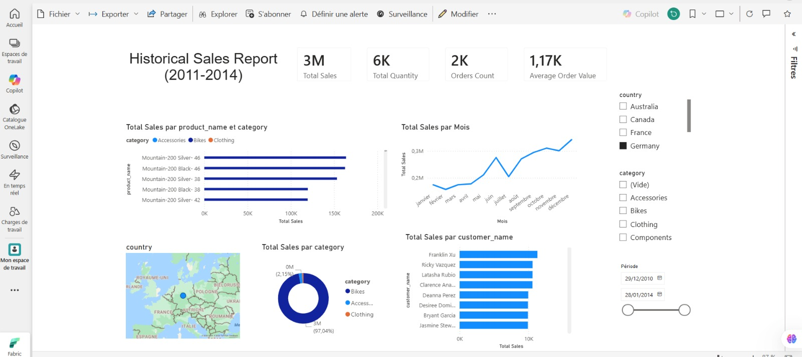

# SQL Data Warehouse Project

> **Project Type:** Data Engineering / Data Warehouse Implementation

This project simulates a real-world data warehouse implementation for a retail company, consolidating data from two source systems an ERP and a CRM into a single analytical platform. Built using the Medallion Architecture (Bronze → Silver → Gold), it covers the full ELT pipeline: raw ingestion, data cleansing, and dimensional modeling with a star schema ready for BI consumption.


---

## Data Architecture


The data warehouse follows the **Medallion Architecture**, structured into three logical layers to ensure data quality, maintainability, and analytical readiness.

### Architecture Layers

#### 🥉 Bronze Layer
Stores raw data ingested directly from source systems. Data is loaded as-is from CSV files into SQL Server tables with minimal processing.

#### 🥈 Silver Layer
Contains cleansed and standardized data. This layer handles data quality checks, normalization, deduplication, and basic transformations.

#### 🥇 Gold Layer
Holds curated, business-ready data structured using dimensional modeling (star schema), prepared for downstream analytics and BI consumption.

Architecture and modeling diagrams are available in the `docs/` directory.

---

## Data Flow


---

## Data Model


---

## Dashboard & Analytics

The Gold layer data was connected to **Power BI** via **Microsoft Fabric** to validate the analytical readiness of the warehouse.



**Key metrics visualized:**
- Total Sales, Total Quantity, Orders Count, Average Order Value
- Sales breakdown by product, category, customer, and month
- Geographic distribution by country
- Interactive filters: country, category, and date range (2011–2014)

---

## Project Scope

This project includes:

### Modern Data Warehouse Design
Implementation of a Medallion Architecture with Bronze, Silver, and Gold layers.

### ELT Processes
Raw data is first loaded as-is into the Bronze layer, then transformed progressively through Silver and Gold layers directly within SQL Server.

### Data Modeling
Design of fact and dimension tables optimized for analytical use cases.

---

## Skills Demonstrated

This project showcases practical experience in:

- SQL Development
- Data Warehousing Concepts
- Medallion Architecture
- ELT Pipelines
- Data Cleansing and Standardization
- Dimensional Data Modeling (Star Schema)
- Data Quality Testing
- BI Dashboard Development (Power BI + Microsoft Fabric)

---

## Tools & Technologies

All tools used in this project are free and commonly used in industry:

| Tool | Purpose |
|------|---------|
| **SQL Server Express** | Data warehouse platform |
| **SQL Server Management Studio (SSMS)** | Database development and management |
| **CSV Files** | Source data from ERP and CRM systems |
| **Draw.io** | Architecture, data flow, and data model diagrams |
| **Power BI + Microsoft Fabric** | Dashboard and analytical validation |
| **Git & GitHub** | Version control and project management |

---

## Project Requirements

### Data Engineering – Data Warehouse Construction

**Objective**  
Build a structured data warehouse to consolidate sales data from ERP and CRM source systems and prepare it for analytical consumption.

**Specifications**

- Import data from ERP and CRM systems provided as CSV files
- Preserve raw data in the Bronze layer
- Apply cleansing and transformation logic in the Silver layer
- Create dimensional models in the Gold layer
- Document data models and architecture clearly
- Validate the Gold layer through a Power BI dashboard

---

## How to Run

### Prerequisites
- SQL Server Express (free)
- SQL Server Management Studio (SSMS)

### Steps

1. **Clone the repository**
   ```bash
   git clone https://github.com/WiamBouda/sql-data-warehouse-project.git
   ```

2. **Load the Bronze layer**  
   Execute scripts in `scripts/bronze/` to ingest raw CSV data from `datasets/`.

3. **Transform into Silver**  
   Run scripts in `scripts/silver/` to apply cleansing, normalization, and deduplication.

4. **Build the Gold layer**  
   Execute scripts in `scripts/gold/` to create fact and dimension tables (star schema).

5. **Run data quality checks**
   ```sql
   -- Silver layer checks
   scripts/tests/quality_checks_silver.sql

   -- Gold layer checks
   scripts/tests/quality_checks_gold.sql
   ```

>  Run scripts in order: Bronze → Silver → Gold. Each layer depends on the previous one.

---

## Repository Structure

```text
data-warehouse-project/
│
├── datasets/                      # Raw source datasets (CSV files)
│
├── docs/                          # Architecture and documentation
│   ├── data_architecture.png      # Medallion architecture diagram
│   ├── dataflow.jpeg              # Data flow diagram
│   ├── data_model.jpeg            # Star schema models
│   └──  dashboard_fabric.png       # Power BI dashboard (Fabric) 
│   
│
├── scripts/                       # SQL scripts
│   ├── bronze/                    # Raw data ingestion
│   ├── silver/                    # Data cleansing and transformation
│   └── gold/                      # Dimensional modeling
│
├── tests/                         # Data quality checks
│   ├── quality_checks_gold.sql    # Gold layer data quality checks
│   └── quality_checks_silver.sql  # Silver layer data quality checks
│
└── README.md                      # Project documentation
```

---

## Author

**Wiam Bouda**  
Student Engineer in Big Data & Artificial Intelligence  
